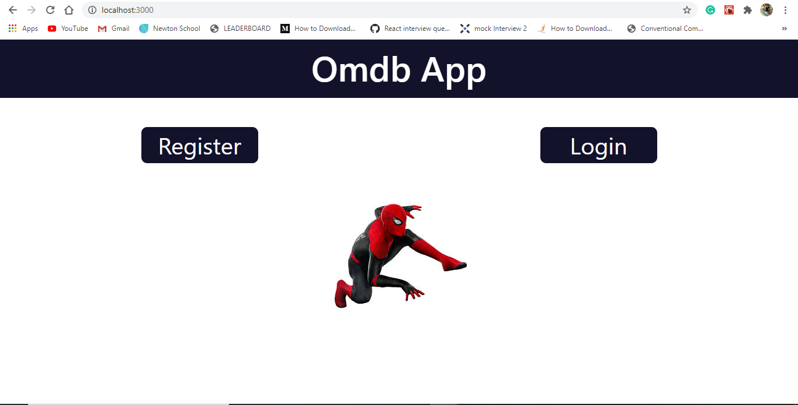
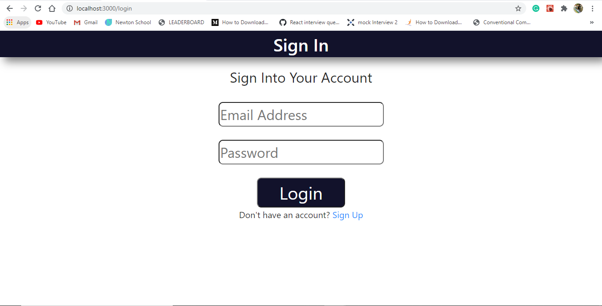
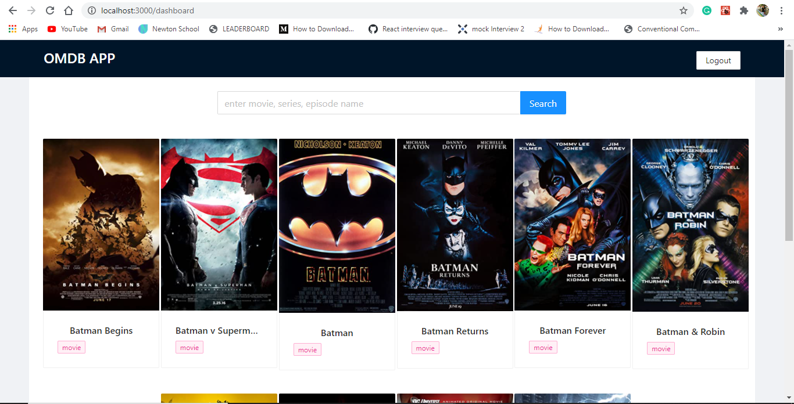

OMDB APP : 
A simple react application to find movies, series and episodes. 
This app have features :
1. Login
2. Register
3. Movie Search Using OMDB API (I have used the OMDB API. I have also used the Ant Design for UI.)

#Run on the localhost using npm run dev
